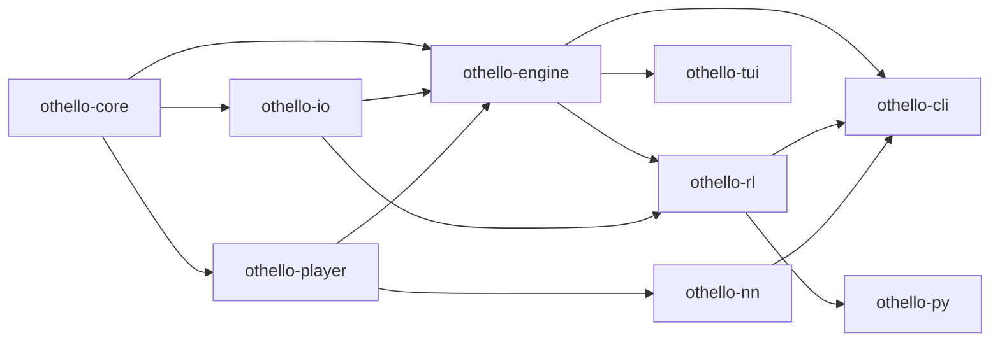

# Architecture

This document explains the internal layout of `rs-othello-sim`: how the
crates depend on each other, how the board representation is chosen at
runtime, what the MCTS player does (including the Phase 6.2 tree-reuse
behaviour), and how evaluators, batch runners, the NN crate, and the
replay buffer plug into the rest of the system.

It is the engineering counterpart to the high-level design document at
`設計書/Othello_シミュレータ設計書.md`. Whereas the design document
captures intent and decision history, this file describes what the
codebase actually does after Phases 1–6.7.

## Crate Dependency Graph



Dependencies flow from leaves (`othello-core`) up toward user-facing
crates. There are no cycles, and each crate exposes only the surface
required by its direct dependents:

- `othello-core` — types, rules, board representations.
- `othello-io` — readers and writers for GGF, JSON, WTHOR, JSONL.
- `othello-player` — `Player` / `Evaluator` traits and concrete
  players (Random, Greedy, Human, MCTS, ExternalEngine). See
  [external-engines.md](external-engines.md) for the subprocess
  driver.
- `othello-engine` — game loop, history snapshots, batch runner.
- `othello-rl` — Gymnasium and PettingZoo compatible environments
  plus the [replay buffer](replay-buffer.md) (Phase 6.7). It depends
  on `othello-io` so transitions can be built from saved records.
- `othello-nn` — Candle-backed policy/value evaluator
  (Phase 6.4). Sits next to `othello-player`, plugs in via the same
  `Player` and `Evaluator` traits, and is only linked by
  `othello-cli`. See [nn-evaluator.md](nn-evaluator.md).
- `othello-tui` — ratatui terminal frontend.
- `othello-cli` — clap-driven CLI binary; the only crate that links
  Candle.
- `othello-py` — PyO3 bindings exposing `OthelloEnv`,
  `OthelloMultiEnv`, and `ReplayBuffer` to Python.

## Hybrid Board Representation

`Board` is an enum with two variants:

```rust
pub enum Board {
    Bitboard8(Bitboard8), // 8x8, packed into two u64s
    Generic(GenericBoard), // arbitrary N x M, Vec<Option<Color>>
}
```

The hybrid choice is deliberate. The 8x8 path is the common case and
demands the throughput targets in §9 of the design document
(>=10^6 moves/sec single-threaded random self-play, >=10^7 legal-move
generations/sec). A bitboard-only library could not service the
research questions that motivate non-square or larger boards.
`GenericBoard` covers 4x4 through 26x26 with straightforward Vec-based
storage, accepting a slower constant factor in exchange for flexibility.

`Board::standard` dispatches at construction time: 8x8 boards are built
as `Bitboard8`, all other valid sizes as `GenericBoard`. Every method
on `Board` (legal moves, apply, terminal check, count) is a thin
dispatch over both variants. Property tests in
`crates/othello-core/tests/property_tests.rs` verify that the two
implementations agree on 8x8.

## MCTS Player

`MctsPlayer` (in `crates/othello-player/src/mcts.rs`) is a textbook UCT
implementation:

1. **Selection** — descend from the root by
   `argmax_a Q(a) + c * sqrt(ln(N_parent) / N(a))`.
2. **Expansion** — when the current node still has untried legal moves,
   pop one (uniformly at random) and add it as a new child.
3. **Simulation** — random rollout to the terminal state or
   `MctsConfig::max_rollout_depth`.
4. **Backpropagation** — propagate +1 / 0 / -1 (from the player who is
   about to move at each ancestor) up to the root.

`MctsConfig` exposes `simulations`, `exploration` (default `sqrt(2)`),
`seed`, `max_rollout_depth`, and (since Phase 6.2) `tree_reuse`.

### Tree Reuse (Phase 6.2)

When `MctsConfig::tree_reuse` is `true`, `MctsPlayer` keeps the
subtree rooted at the move it just played. On the next call to
`select_move`, the player applies the opponent's reply
(`state.last_move`) to that subtree's root and promotes the matching
grandchild to be the new root. The visit counts and accumulated value
estimates of the surviving nodes carry over into the new search,
amortising the per-move cost across the game.

Two state fields back the feature on `MctsPlayer`:

- `persisted_tree: Option<MctsTree>` — the subtree saved at the end of
  the previous `select_move`. Its root corresponds to the post-our-move
  position; its children correspond to opponent replies.
- `persisted_root_state: Option<GameState>` — the position the saved
  root is supposed to represent, used as a fallback consistency check.

The lookup strategy is **move-indexed**: every `MctsNode` stores its
children as `Vec<(Move, usize)>`, and tree reuse looks up the saved
root's child by the opponent's `Move`. If the lookup misses, or if the
located child's board does not match `state.board`, `MctsPlayer` warns
via `tracing::warn!` and rebuilds a fresh tree. The same fallback
covers `state.last_move == None` (e.g., a freshly initialised game) and
`reset()`-induced clearing.

When promoting a grandchild to the new root, the implementation flips
the sign of its `score_sum` if its old parent's `side_to_move` differs
from the grandchild's own. The original convention is "each node
accumulates value from its parent's side-to-move perspective"; once the
grandchild becomes a root and inherits the convention "from root's
side-to-move perspective", the recorded sums need a one-time inversion
on the new root. All other inherited nodes preserve their parent
relationship and require no adjustment.

The default is `tree_reuse: false` so existing callers and tests
observe the legacy behaviour unchanged. The
`crates/othello-player/benches/mcts_tree_reuse.rs` criterion benchmark
exercises both modes back-to-back for an A/B comparison.

## Evaluator Trait

`Evaluator` (declared in `crates/othello-player/src/traits.rs`) lets a
player expose move-distribution information to consumers:

```rust
pub trait Evaluator {
    fn evaluate(&mut self, state: &GameState) -> Option<HashMap<Move, f32>>;
}
```

`MctsPlayer` implements `Evaluator` by exposing the normalised root
visit counts captured at the end of its most recent `select_move` call.
The values sum to ~1.0 and live in `[0, 1]`. Consumers (e.g., the TUI
Observe-mode evaluator overlay introduced in Phase 5) read them via
`Player::evaluator(&mut self) -> Option<&mut dyn Evaluator>`. The NN
evaluator (Phase 6.4) plugs in through the same trait — see
[nn-evaluator.md](nn-evaluator.md) for the IO schema, supported weight
formats (safetensors / ONNX), and the CLI integration.

## othello-nn (Phase 6.4)

`othello-nn` lives in its own crate so that Candle's heavy dependency
tree (gemm, half, candle-core / candle-nn / candle-onnx) does not
leak into `othello-player` (and therefore into every crate that
depends on it). The crate exposes:

- `CandleModel` — a small AlphaZero-style ResNet (3-channel input,
  policy head over `H*W + 1` actions, scalar value head). Loaders:
  `from_safetensors`, `random_init`.
- `OnnxModel` — `candle_onnx`-driven loader for ONNX checkpoints.
- `NnEvaluator` — implements both `othello_player::Player` and
  `othello_player::Evaluator`. Caches the post-mask, normalised
  policy in `last_policy` so the TUI Observe overlay can read it
  exactly the same way it reads MCTS visit counts.

`othello-cli::player_spec_with_nn::build_player` is the single place
where Candle is linked. `PlayerSpec::try_build_player` returns
`SpecError::NeedsNnBackend` for `nn:` SPECs so consumers that should
not link Candle (e.g. `othello-py`) fail cleanly.

## othello-rl::replay_buffer (Phase 6.7)

`othello-rl` hosts a uniform / prioritized experience replay buffer
under `replay_buffer/`. The buffers share a `ReplayBuffer` trait so
generic training loops do not need to branch on backend.

- `UniformReplayBuffer` — circular FIFO with uniform sampling.
- `PrioritizedReplayBuffer` — proportional PER backed by a
  `SumTree` for `O(log N)` priority lookups, with importance-sampling
  weights and a configurable `beta` schedule.
- `transitions_from_record[_both_sides]` — converts a `GameRecord`
  (any reader format) into per-ply `Transition`s including the
  3-channel observation, action, terminal value, and legal mask.

The Python wrapper in `othello-py` calls into the same Rust types
through PyO3 with numpy interop. See
[replay-buffer.md](replay-buffer.md) for the full schema and a
training-loop sketch.

## BatchRunner and ProgressCallback

`BatchRunner` in `crates/othello-engine/src/batch.rs` parallelises
self-play games using `rayon`. Its `BatchConfig` carries:

- `num_games`, `num_threads`, `seed`, `swap_colors` — the basic knobs.
- `log_dir` — optional output directory for per-game records and JSONL
  logs.
- `progress: Option<Arc<dyn ProgressCallback>>` — a callback invoked
  after each game completes. The CLI `selfplay` subcommand wires this
  to an `indicatif::ProgressBar`; library users can implement the trait
  to integrate with their own UIs.

The `factory` closure passed to `BatchRunner::run` produces a fresh
`(Box<dyn Player>, Box<dyn Player>)` pair per game, seeded from the
base seed plus the game index. This keeps each game deterministic
without sharing mutable state across threads.
