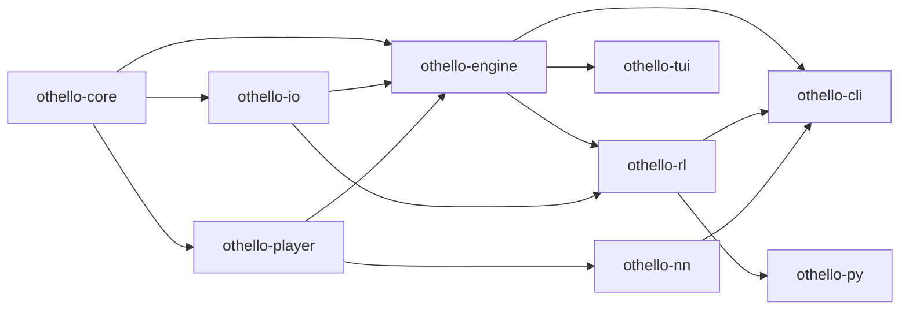

[English](../architecture.md) | [日本語](architecture.md)

# アーキテクチャ

このドキュメントは `rs-othello-sim` の内部レイアウトを説明します．具体的には，クレート間の依存関係，盤面表現の実行時選択， MCTS Player の動作 ( Phase 6.2 の tree-reuse を含む ) ， evaluator ・ batch runner ・ NN クレート・ replay buffer の組み込み方を扱います．

これは設計書 `設計書/Othello_シミュレータ設計書.md` のエンジニアリング側のカウンターパートです．設計書が意図と意思決定の履歴を記録するのに対し，本ファイルは Phase 1〜6.7 を経た時点でコードベースが実際に何をしているかを記述します．

## クレート依存グラフ



依存は葉 ( `othello-core` ) からユーザ向けクレートへ流れます．循環は無く，各クレートはその直接の依存元が必要とする最小の表面のみを公開します:

- `othello-core` — 型，ルール，盤面表現．
- `othello-io` — GGF / JSON / WTHOR / JSONL の reader・writer．
- `othello-player` — `Player` / `Evaluator` トレイトと具体的 Player ( Random ， Greedy ， Human ， MCTS ， ExternalEngine ) ．サブプロセスドライバについては [external-engines.md](external-engines.md) を参照．
- `othello-engine` — game loop ，履歴スナップショット， batch runner ．
- `othello-rl` — Gymnasium / PettingZoo 互換環境と [Replay buffer](replay-buffer.md) ( Phase 6.7 ) ．保存済み棋譜から transition を構築できるよう `othello-io` に依存．
- `othello-nn` — Candle ベースのポリシー / バリュー evaluator ( Phase 6.4 ) ． `othello-player` の隣に位置し，同じ `Player` / `Evaluator` トレイト経由で接続される． `othello-cli` のみがリンクする． [nn-evaluator.md](nn-evaluator.md) を参照．
- `othello-tui` — ratatui のターミナルフロントエンド．
- `othello-cli` — clap ベースの CLI バイナリ．Candle をリンクする唯一のクレート．
- `othello-py` — `OthelloEnv` ， `OthelloMultiEnv` ， `ReplayBuffer` を Python に公開する PyO3 バインディング．

## Hybrid Board 表現

`Board` は 2 バリアントを持つ enum です:

```rust
pub enum Board {
    Bitboard8(Bitboard8), // 8x8 ， 2 つの u64 にパック
    Generic(GenericBoard), // 任意 N x M ， Vec<Option<Color>>
}
```

このハイブリッドは意図的な設計です．8x8 のパスは典型ケースで，設計書 §9 のスループット目標 ( シングルスレッド random self-play で >=10^6 moves/sec ，合法手生成で >=10^7 ops/sec ) を満たす必要があります．Bitboard だけのライブラリでは，本リポジトリが対象とする「正方形でない盤面・大きい盤面」の研究テーマに応えられません．`GenericBoard` は 4x4 〜 26x26 を Vec ベースの素直なストレージでカバーし，柔軟性と引き換えに定数倍の遅さを許容します．

`Board::standard` は構築時に分岐し， 8x8 を `Bitboard8` ，それ以外の有効サイズを `GenericBoard` として作ります． `Board` の各メソッド ( 合法手・着手適用・終局判定・石数 ) は両バリアントへの薄いディスパッチです． `crates/othello-core/tests/property_tests.rs` のプロパティテストで，両実装が 8x8 で一致することを検証しています．

## MCTS Player

`MctsPlayer` ( `crates/othello-player/src/mcts.rs` ) は教科書通りの UCT 実装です:

1. **Selection** — `argmax_a Q(a) + c * sqrt(ln(N_parent) / N(a))` で root から下る．
2. **Expansion** — 現在ノードに未試行の合法手があれば，1 つを ( 一様ランダムに ) 取り出して新しい子ノードとして追加．
3. **Simulation** — 終局または `MctsConfig::max_rollout_depth` までのランダム rollout．
4. **Backpropagation** — 各祖先で「これから着手する側」の視点で +1 / 0 / -1 を root まで伝播．

`MctsConfig` は `simulations` ， `exploration` ( デフォルト `sqrt(2)` ) ， `seed` ， `max_rollout_depth` ，および ( Phase 6.2 以降の ) `tree_reuse` を公開します．

### Tree Reuse ( Phase 6.2 )

`MctsConfig::tree_reuse` が `true` の場合， `MctsPlayer` は自分が直前に打った手のサブツリーを保持します．次回の `select_move` 呼び出しでは，相手の応手 ( `state.last_move` ) をそのサブツリーの root に適用し，対応する孫ノードを新しい root に昇格させます．生き残ったノードの訪問数と累積価値推定値が新しい探索に引き継がれ，1 手あたりのコストを対局全体で償却できます．

このフィーチャを支える状態フィールドは 2 つです:

- `persisted_tree: Option<MctsTree>` — 直前 `select_move` の終了時点で保存したサブツリー．root は「自分が打った後の局面」に対応し，子は相手の応手に対応します．
- `persisted_root_state: Option<GameState>` — 保存 root が表すはずの局面．フォールバック用の整合性チェックに使います．

ルックアップは **手キー方式** です．各 `MctsNode` は子を `Vec<(Move, usize)>` として持ち， tree reuse は相手の `Move` で保存 root の子を引きます．ルックアップが外れたり，見つけた子の盤面が `state.board` と一致しない場合， `MctsPlayer` は `tracing::warn!` で警告し，新しいツリーを再構築します．同じフォールバックは `state.last_move == None` ( 初期化直後など ) や `reset()` によるクリアにも適用されます．

孫ノードを新 root に昇格する際，旧親の `side_to_move` と孫自身のそれが異なる場合は `score_sum` の符号を反転します．元の規約は「各ノードはその親の side-to-move 視点で価値を蓄積する」ですが，孫が root になり「root の side-to-move 視点」という規約を引き継ぐため，新 root の累積値だけ 1 回反転が必要です．他の継承ノードはすべて親子関係を保ったままなので調整不要です．

デフォルトは `tree_reuse: false` で，既存呼び出しとテストの挙動を変えないようにしています． `crates/othello-player/benches/mcts_tree_reuse.rs` の criterion ベンチマークが両モードを連続で実行し A/B 比較を行います．

## Evaluator トレイト

`Evaluator` ( `crates/othello-player/src/traits.rs` で宣言 ) は，Player が手の分布情報を消費側に公開するためのトレイトです:

```rust
pub trait Evaluator {
    fn evaluate(&mut self, state: &GameState) -> Option<HashMap<Move, f32>>;
}
```

`MctsPlayer` は，直近 `select_move` で記録した正規化済み root 訪問数を公開する形で `Evaluator` を実装します．値は合計約 1.0 で `[0, 1]` の範囲に収まります．消費側 ( 例: Phase 5 で導入された TUI Observe-mode の evaluator overlay ) は `Player::evaluator(&mut self) -> Option<&mut dyn Evaluator>` 経由で取得します．NN evaluator ( Phase 6.4 ) も同じトレイト経由で接続されます — IO スキーマ，対応重みフォーマット ( safetensors / ONNX ) ， CLI 連携については [nn-evaluator.md](nn-evaluator.md) を参照してください．

## othello-nn ( Phase 6.4 )

`othello-nn` を独立クレートにしているのは， Candle の重い依存ツリー ( gemm ， half ， candle-core / candle-nn / candle-onnx ) を `othello-player` ( ひいてはその下流すべて ) に染み出させないためです．クレートが公開するのは:

- `CandleModel` — 小型の AlphaZero 風 ResNet ( 3 チャネル入力，行動空間 `H*W + 1` のポリシーヘッド，スカラー値のバリューヘッド ) ．ローダーは `from_safetensors` ， `random_init` ．
- `OnnxModel` — `candle_onnx` ベースの ONNX ローダー．
- `NnEvaluator` — `othello_player::Player` と `othello_player::Evaluator` の両方を実装．マスク後・正規化済みのポリシーを `last_policy` にキャッシュするので， TUI Observe overlay は MCTS の訪問数と全く同じ要領で読めます．

`othello-cli::player_spec_with_nn::build_player` が Candle をリンクする唯一の場所です． `PlayerSpec::try_build_player` は `nn:` SPEC に対し `SpecError::NeedsNnBackend` を返すため， Candle をリンクすべきでない呼び出し元 ( 例: `othello-py` ) は明示的に失敗できます．

## othello-rl::replay_buffer ( Phase 6.7 )

`othello-rl` は uniform / prioritized experience Replay buffer を `replay_buffer/` 配下に持ちます．両 buffer は `ReplayBuffer` トレイトを共有しており，汎用学習ループはバックエンドで分岐する必要がありません．

- `UniformReplayBuffer` — 一様サンプリングの循環 FIFO．
- `PrioritizedReplayBuffer` — 比例 PER ． `SumTree` で `O(log N)` の priority ルックアップ．Importance-sampling 重みと設定可能な `beta` スケジュール付き．
- `transitions_from_record[_both_sides]` — `GameRecord` ( 任意の reader フォーマット ) を ply ごとの `Transition` ( 3 チャネル observation ， action ，終局値，合法手マスク ) に変換．

`othello-py` の Python ラッパーは PyO3 と numpy 連携で同じ Rust 型を呼び出します．完全なスキーマと学習ループのスケッチは [replay-buffer.md](replay-buffer.md) を参照してください．

## BatchRunner と ProgressCallback

`crates/othello-engine/src/batch.rs` の `BatchRunner` は `rayon` を使って self-play 対局を並列化します． `BatchConfig` は次を保持します:

- `num_games` ， `num_threads` ， `seed` ， `swap_colors` — 基本パラメータ．
- `log_dir` — 局ごとの棋譜と JSONL ログの出力先 ( 任意 ) ．
- `progress: Option<Arc<dyn ProgressCallback>>` — 各局終了後に呼ばれるコールバック． CLI の `selfplay` サブコマンドはこれを `indicatif::ProgressBar` に接続します．ライブラリ利用者は独自 UI 連携のためにこのトレイトを実装できます．

`BatchRunner::run` に渡す `factory` クロージャは局ごとに新しい `(Box<dyn Player>, Box<dyn Player>)` ペアを生成し，ベース seed と局インデックスから seed を導出します．これによりスレッド間で可変状態を共有せずに各局の決定性を保てます．
